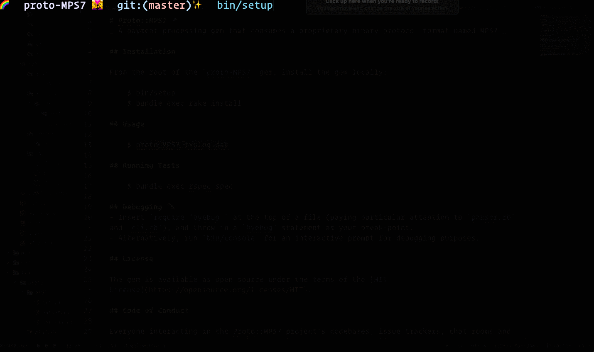

# Proto::MPS7 🛸
_ A payment processing gem that consumes a proprietary binary protocol format named MPS7 _

## Installation

From the root of the `proto-MPS7` gem, install the gem locally:

    $ bin/setup
    $ bundle exec rake install

## Usage

    $ proto_MPS7 txnlog.dat

## Running Tests

    $ bundle exec rspec spec

## Debugging 🐛
- Insert `require 'byebug'` at the top of a file (paying particular attention to `parser.rb` and `cli.rb`), and throw in a `byebug` statement as your break-point.
- Alternatively, run `bin/console` for an interactive prompt for debugging purposes.

## License

The gem is available as open source under the terms of the [MIT License](https://opensource.org/licenses/MIT).

## Code of Conduct

Everyone interacting in the Proto::MPS7 project’s codebases, issue trackers, chat rooms and mailing lists is expected to follow the [Contributor Covenant](http://contributor-covenant.org) code of conduct.
